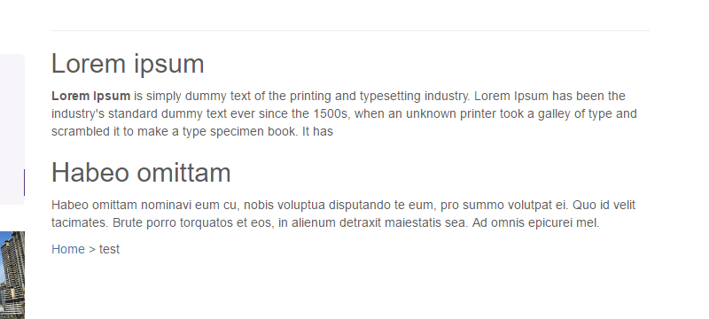

# Block Editable

## General

The block element is an iterating component which is really powerful.
Basically a block is only a loop, but you can use other editables within this loop, so it's possible to repeat a set of 
editables to create structured content (eg. a link list, or a image gallery).
The items in the loop as well as their order can be defined by the editor with the block controls provided in the editmode. 

## Configuration

| Name        | Type      | Description                                                                                                                  |
|-------------|-----------|------------------------------------------------------------------------------------------------------------------------------|
| `limit`     | integer   | Max. amount of iterations.                                                                                                   |
| `reload`    | bool      | Reload editmode on add, move or remove (default=false)                                                                       |
| `default`   | integer   | If block is empty, this specifies the iterations at startup.                                                                 |
| `manual`    | bool      | Forces the manual mode, which enables a complete custom HTML implementation for blocks, for example using `<table>` elements |
| `class`     | string    | A CSS class that is added to the surrounding container of this element in editmode                                           |

## Methods

| Name            | Return    | Description                                                   |
|-----------------|-----------|---------------------------------------------------------------|
| `isEmpty()`     | bool      | Whether the editable is empty or not.                         |
| `getCount()`    | int       | Get the total amount of iterations.                           |
| `getCurrent()`  | int       | Get the current index while looping.                          |
| `getElements()` | array     | Return a array for every loop to access the defined children. |

## The Block Controls

| Control                                   | Operation                                |
|-------------------------------------------|------------------------------------------|
|             | Add a new block at the current position. |
|                | Remove the current block.                |
|  | Move Block up and down.                  |

## Basic Usage

```twig

    <h2>{{ pimcore_input("subline") }}</h2>
    {{ pimcore_wysiwyg("content") }}

```

The result in editmode should looks like to following: 


And in the frontend of the application:


## Advanced Usage

### Example for `getCurrent()`

```twig


    
        Insert this line only after the first iteration<br />
        <br />
    

    <h2>{{ pimcore_input("subline") }}</h2>

```

> **IMPORTANT**
> If you want to change content structure dynamically for each index in editmode, then it is required to use `reload=true` config.

### Using Manual Mode

The manual mode offers you the possibility to deal with block the way you like, this is for example useful with tables: 

```twig

<table>
    <tr>
        
            
              <td customAttribute="{{ pimcore_input("myInput").getData() }}">
                    
                        <div style="width:200px; height:200px;border:1px solid black;">
                            {{ pimcore_input("myInput") }}
                        </div>
                    
                </td>
            
        
    </tr>
</table>

```

### Using Manual Mode with custom button position

If you want to wrap buttons in a div or change the Position.

```twig

<table>
    <tr>
        
            
                <td customAttribute="{{ pimcore_input("myInput").data }}">
                    
                        <div style="background-color: #fc0; margin-bottom: 10px; padding: 5px; border: 1px solid black;">
                            
                        </div>
                        <div style="width:200px; height:200px;border:1px solid black;">
                            {{ pimcore_input("myInput") }}
                        </div>
                    
                </td>
            
        
    </tr>
</table>

```

### Using Manual Mode with additional css class for element in editmode

```twig

<div>
    
        
            
                Add additional class 'my-addional-class' to editmode-div
            
        
    
</div>

```


### Accessing Data Within a Block Element

Bricks and structure refer to the CMS demo (content/default template).

```twig
{# load document #}


{# get the first picture from the first "gallery-carousel" brick #}


{{ dump(document.getEditable('content').getElement('gallery-single-images')) }}
{{ dump(image.getSrc()) }}
```
