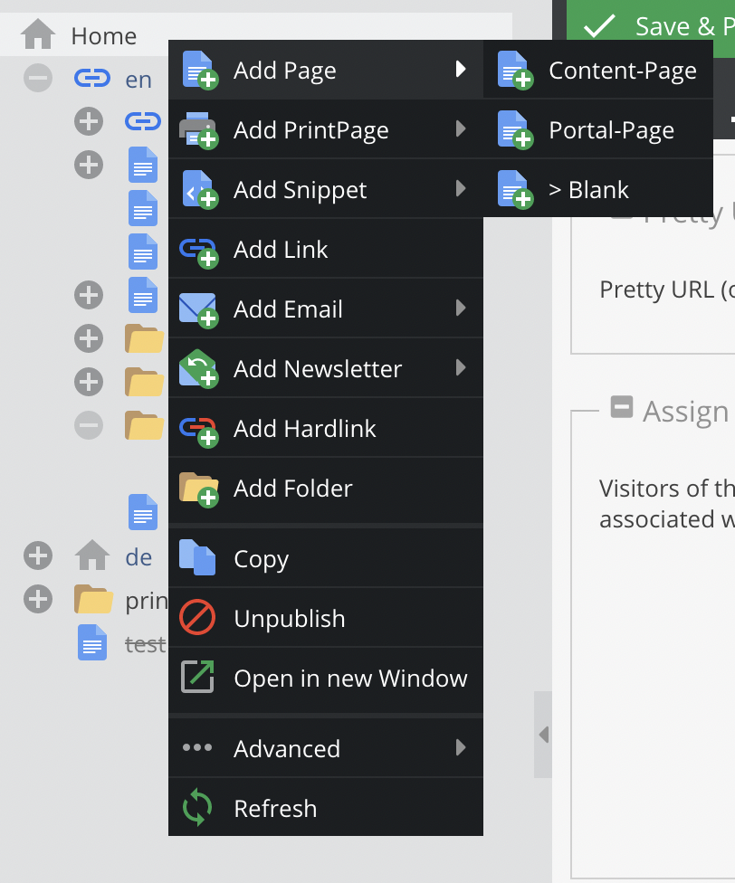

# Predefined Document-Types

## General

Pimcore provides the ability to define preconfigurations for documents, which makes it easier for editors to work with 
many different controller/action and templates. 
By using this feature the editors don't have to have any knowledge of which controller/action/template 
should be used in a specific document because they can choose out of a predefined set of configurations with a friendly name. 

## Example

To define document-type go to *Settings* > *Document-Types*.

Let's suppose that you've created controller, action and template for a books listing.

Reference to the action: `App\Controller\BookController::listAction`  
Reference to the template: `templates/book/list.html.twig`

To add a new document-type which renders the book listing template, you have to click on the *Add* button first and then
fill out the newly created configuration row accordingly. 

The type can be either a `page`, `snippet`, `email`.  
`printcontainer` or `printpage` are only available if the PimcoreWebToPrintBundle is enabled and installed.  
`newsletter` is only available if the PimcoreNewsletterBundle is enabled and installed.

After you have defined a type you can access it in the context menu or in the document settings:

##### Document Settings Preview

##### Context Menu Preview

