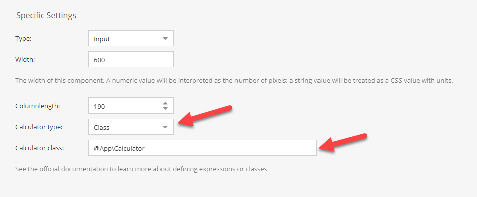

# Calculated Value Datatype


## General

The calculated-value datatype allows you to calculate attributes based on the value of various other attributes. The 
value is always calculated on the fly when calling the corresponding getter, no caching applied.

The only data stored is the one in the object's query tables for being able to query for calculated values.

> Values in the query table are only updated when the data object is saved. So be careful, the values in the query 
> table might not be up-to-date depending on the caluclation parameters.  

As display type in object editor three types are available: 
- Input: Single line, displayed as read-only input field.
- TextArea: Multi line, displayed as read-only text area.
- HTML: Multi line HTML content, displayed as display field.


## Calculation

For defining the calculation two options are available:

### Expression

The simplest way for defining the calculation is providing an expression. The expression language is based on the 
[symfony expression language component](https://symfony.com/doc/current/components/expression_language.html). Please 
see [syntax docs](https://symfony.com/doc/current/components/expression_language/syntax.html) for details concerning 
possibilities. 

##### Available variables 
- DataObject itself as `object`.  
- Context information as `data` (details see Context Information for Calculation below).

##### Simple examples
```
# print ID of data object
object.getId()

# print firstname and lastname of data object
object.getFirstname() ~ ' ' ~ object.getLastname()

# check if field is empty
object.getText() != '' ? 'yes' : 'no'

# get fieldname of current field
data.getFieldname()

```

### Calculator Class

The second option for defining the calculation is providing a php calculator class. This is especially useful for more
complex calculations and reusing the calculators. 

The calculator class is a standard symfony service (or simple php class) that implements the `CalculatorClassInterface`.

#### Setup in Class Definition
The calculator class can be defined in two ways:  
- **Symfony service** (prefered way): Provide service name prefixed with `@` (e.g. `@service_name`), service needs to be public.  
- **Standard PHP class**: Provide fully qualified namespace name of class, Pimcore will instanciate it with `new`. 




#### Calculator Class Implementation

Let's suppose we have a very simple class with 2 number fields called xValue and yValue and a calculated-value field 
called `sum` placed inside a localizedfields container.

The PHP calculator class needs to implement the `CalculatorClassInterface` interface. 

The `compute` method needs to be implemented which computes the result for the `sum` field. 
The arguments passed into this method is the Pimcore object and the contextual information 
with details about calculated-value field is affected and where it is located at
(details see Context Information for Calculation below).

```php
namespace App;

use Pimcore\Logger;
use Pimcore\Model\DataObject\Concrete;
use Pimcore\Model\DataObject\ClassDefinition\CalculatorClassInterface;
use Pimcore\Model\DataObject\Data\CalculatedValue;
 
class Calculator implements CalculatorClassInterface
{
    public function compute(Concrete $object, CalculatedValue $context): string
    {
        if ($context->getFieldname() == "sum") {
            $language = $context->getPosition();
            return $object->getXValue($language) + $object->getYValue($language);
        } else {
            Logger::error("unknown field");
            return '';
        }
    }
} 
```

As we see here, the calculator class sums up the x and y values from the corresponding language tab.

In addition to the `compute` method you need to implement the `getCalculatedValueForEditMode` method. 
This method is used to display the value in object edit mode:

```php
public function getCalculatedValueForEditMode(Concrete $object, CalculatedValue $context): string
{
    $language = $context->getPosition();
    $result = $object->getXValue($language) . " + " . $object->getYValue($language) . " = " . $this->compute($object, $context);
    return $result;
}
```

#### Result 

The visual outcome would be as follows: 


## Context Information for Calculation
The content of the context information depends on the location of the calculated-value field in the 
data model.

#### Object (top-level)

| Name | Description |
| --- | ---- |
| ownerType | `"object"` |
| fieldName | the name of the calcuated-value field (e.g. `sum`) |


#### Localizedfields

| Name | Description |
| --- | ---- |
| position | the language ("en", "de", ...) |
| ownerType | `"localizedfield"` |
| ownerName | the name of the localized field ("localizedfields") | 


#### Objectbricks

| Name | Description |
| --- | ---- |
| ownerType | `"objectbrick"` |
| ownerName | the name of the objectbrick field inside the object |
| fieldName | the name of the attribute inside the brick |
| index | the name of the brick |
| keyDefinition | the calculated-value field definition |
| position | the language ("en", "de", ...) if calculated field is localized |


#### Fieldcollections

| Name | Description |
| --- | ---- |
| ownerType | `"fieldcollection"` |
| ownerName | the name of the fieldcollection attribute |
| fieldName | the name of the attribute inside the fieldcollection |
| index | the index of the fieldcollection item |
| keyDefinition | the calculated-value field definition |


#### Classification Store

| Name | Description |
| --- | ---- |
| ownerType | `"classificationstore"` |
| ownerName | the name of the fieldcollection attribute |
| fieldName | the name of the attribute inside the fieldcollection |
| position  | the language |
| groupId   | group id |
| keyId     | key id |
| keyDefinition | the fielddefinition of the classificationstore attribute |


## Working with PHP API

Getter methods on the object class are generated as usual. The code to retrieve the values would then be:
```php
$object = DataObject::getByPath("/demoobject");
$valueDe =  $object->getSum("de");   // => 38
$valueEn =  $object->getSum("en");   // => 11
```
