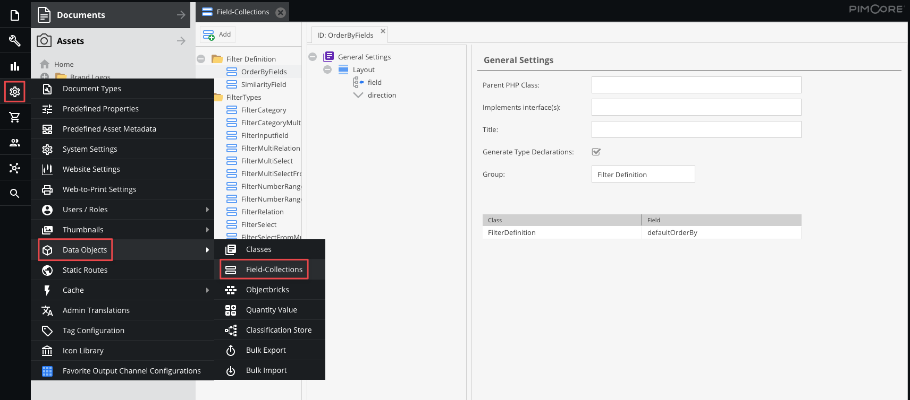
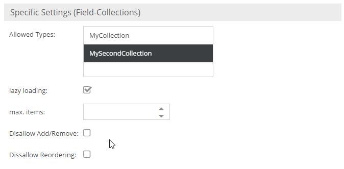
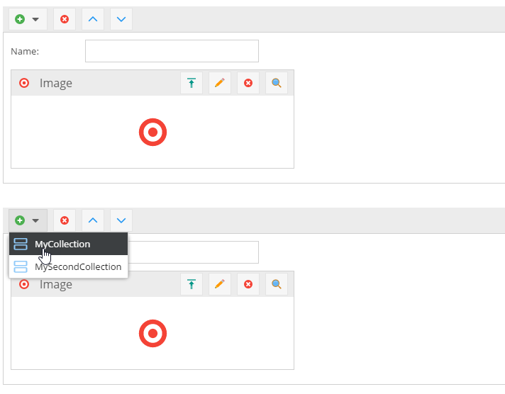

# Fieldcollection

## General Usage

Object field collections are predefined sets of data and layout fields, 
that can be added to objects at an arbitrary amount.

An object field collection is very similar to an object itself. 
It has a *class* or in this case **field definition** which needs to be made first, and then different field collection 
definitions can be used to add sets of fields to an object. 



So with some restrictions you could say, a field collection is an object within an object. 

When adding a field collection field to an object's class definition, the developer needs to specify the allowed field 
definition types for this field. 



The user can then decide which and how many of the available field definitions shall be added to the object.




## Data Storage

Field definition data is stored in a separate table for each field definition and object class. 
The naming convention for these tables is: `object_collection_COLLECTION-NAME_OBJECT-ID`. 
Such a table contains all the field data, the concrete object's id, field name and index of the field collection 
within the field collection data field. 
In order to fully understand the data structure of objects and field collections, it is best to enter some example data 
and have a look at the tables created by Pimcore.


## Working with PHP API

Of course, field collection data can be set programmatically as well. 
The following code snippet illustrates how this can be achieved. 
Let's say there is an object class **collectiontest** and a fieldcollection called **MyCollection*. 
There is an object field called **collectionitems** which is of the type field collection.

```php
$object = new DataObject\Collectiontest();
  
$object->setParentId(1);
$object->setUserOwner(1);
$object->setUserModification(1);
$object->setCreationDate(time());
$object->setKey(uniqid() . rand(10, 99));

$items = new DataObject\Fieldcollection();

for ($i = 0; $i < 5; $i++) {
    $item = new DataObject\Fieldcollection\Data\MyCollection();
    $item->setMyinput("This is a test " . $i);
    $items->add($item);
}

$object->setCollectionitems($items);
$object->save();
```

If you want to use localized fields inside field collections you have to set the object before calling any localized field - related methods.

```php
$item = new DataObject\Fieldcollection\Data\MyCollection();
$item->setObject($object);
```

## Inheritance

Field collections do not support inheritance out of the box because currently field collection data does not get saved to a query table (so you would not be able to query for inherited data).

Nevertheless, you can use inheritance for field collections for data maintenance by [overriding the class](../../../20_Extending_Pimcore/03_Overriding_Models.md) which contains the field collection field and adding a custom getter method to this overriding class:
```php
// custom getter for field collection field named 'fieldCollection'
public function getFieldCollection(): mixed
{
    $data = parent::getFieldCollection();

    $inheritedData = DataObject\Service::useInheritedValues(true, function() use ($data) {
        if (\Pimcore\Model\DataObject::doGetInheritedValues($this) && $this->getClass()->getFieldDefinition("fieldCollection")->isEmpty($data)) {
            try {
                return $this->getValueFromParent("fieldCollection");
            } catch (\Pimcore\Model\DataObject\Exception\InheritanceParentNotFoundException $e) {
                // no data from parent available, continue ... 
                return null;
            }
        }
        return null;
    });

    return $inheritedData ?? $data;
}
```

Beware that only complete field collection containers can be inherited. As soon as you change the order of the field collection items or any field value in a child object, the whole field collection will get assigned to that child object.

There could also be some UI quirks in the Pimcore backend.
